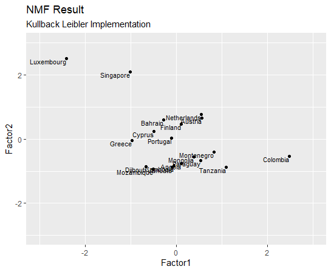

# My NMF
A from-scratch implementation of the Non-Negative Matrix Factorization algorithm done for a course on data mining.

## Based on 
Lee, Daniel D., and H. Sebastian Seung. "Algorithms for non-negative matrix factorization." Advances in neural information processing systems. 2001. 
http://papers.nips.cc/paper/1861-algorithms-for-non-negative-matrix-factorization.pdf

## Dataset
The dataset used for demonstration is the Economic Freedom Index taken from Kaggle. 
https://www.kaggle.com/lewisduncan93/the-economic-freedom-index

## Result
Two factors were extracted.
The results indicate several clusters of countries. On the top left side we see a cluster of small countries with high gdp per capita (Singapore, Luxembourg). In the center of the chart are mostly Central-European countries like Finland, Austria or The Netherlands. Slightly below that a cluster containing African, South-American and  Eastern-European countries emerges.

